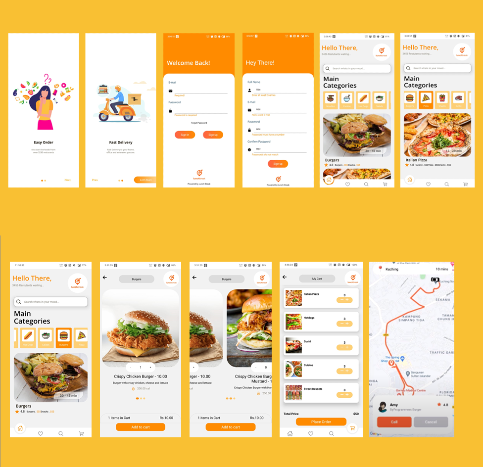

# LunchBreakApp

Lunch Break is a mobile application build react-native-cli.

## Highlight of the LunchBreak Application:

1. Starting with the Onboarding Screen which uses react-native-app-intro-slider.
2. Moving further we come up with log-in or Sign up screens that use Axios and yup library (for validation).
3. After proper login or sign up with get the Home screen of the application which renders the list restaurant list and we can sort the list on the basis of categories of the food.
4. On clicking a particular item from the restaurant list we come to the "Detail screen" of the pressed item. In the Detail screen, there is a button for increment and decrement of the item count which also sums up the total amount for us.
5. We have a "cart screen" that shows the elements in the cart.
6. And lastly "OrderDelivery screen" which uses "react-native-maps" for showing the google map on the screen.
   _All the data which come ups is coming from a local Json file._

## Screen Shots of the various screen of the application.

